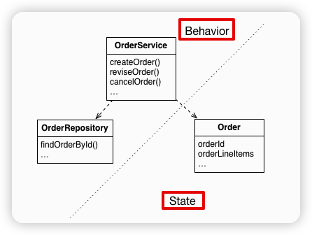
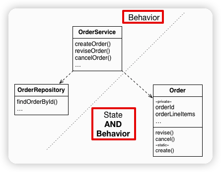

# Business Logic Organization Patterns

마틴파울러의 [Patterns of Enterprise Application Architecture](https://martinfowler.com/books/eaa.html)에 나오는 Business Logic을 구성하는 주요한 패턴 2가지에 대한 설명을 통해 어떤 방식을 취할지 결정할 수 있도록 한다.

## 1. Transaction Script Pattern

객체지향을 좋아하더라도 개발할 비즈니스 로직이 너무 단순한 경우 객체지향 접근은  과할 수 있다. 이런 경우 **절차적인 코드(procedural code)**를 작성한다.

마틴파울러는 이를 [Transaction Script Pattern](http://https://martinfowler.com/eaaCatalog/transactionScript.html)이라고 불렀다.

이 방법에서는 객체지향 설계를 하는 것이 아니라, presentation tier의 요청을 처리하기 위해 transaction script(OrderService의 createOrder, reviseOrder, cancelOrder 등)라고 불리는 메소드를 작성한다.

**이 접근법의 중요한 특성은 아래 그림과 같이 행위를 구현하는 클래스(OrderService)가 상태를 저장하는 클래스(Order)와 분리된다는 것이다.**

스크립트는 보통 Service 클래스(OrderService)에 위치한다. Service는 하나의 요청과 해당 요청에 대한 시스템 행위에 대해서 하나의 메소드를 갖는다. 이 메소드가 해당 요청에 대한 비즈니스 로직을 구현한다. 데이터 객체(Order)는 행위가 없거나 거의 갖지 않는다.

이 접근법은 간단한 비즈니스 로직에는 잘 동작한다. 단점은 복잡한 비즈니스 로직을 구현하기에는 좋은 방법이 아니라는 것이다.

## 2. Domain Model Pattern

Transaction Script Pattern이 단순하여 매우 매력적이지만 **비즈니스 로직이 복잡해지면 유지보수가 악몽이 된다**.

> 오랜 기간 서비스를 운영해 본 개발자라면 변경 요구는 대부분 기능 자체가 아니라 데이터의 변경에 기인한다는 점에 공감할 것이다.
> Transaction Script Pattern에서는 데이터를 가지고 있는 클래스가 행위를 가지고 있지 않아서 데이터의 변경이 생기면 행위를 가지고 있는 클래스에 영향을 미친다. 심지어 행위를 가진 코드가 서비스 클래스 외에 여러곳에 존재한다면 문제는 더 심각해진다.
> 따라서 **운영과 유지보수를 생각한다면 데이터를 캡슐화하고 기능만 외부에 제공하는 방식이여야 데이터의 변경이 생겨도 외부의 영향을 최소화할 수 있다**.

Monolithic Application이 지속적으로 커지는 습성이 있는 것과 같이 Transaction Script도 동일한 문제를 갖는다.

결론적으로 극도로 단순한 어플리케이션을 작성하는 것이 아니라면 절차적 코드를 작성하는 Transaction Script의 유혹을 이겨내고 [Domain Model Pattern](https://martinfowler.com/eaaCatalog/domainModel.html)을 적용하여 객체지향 설계를 개발해야 한다.

객체지향설계에서 비즈니스 로직은 객체모델로 구성된다. 객체모델은 적은 수의 클래스들의 네트워크로 구성된다. 이런 설계 방식에서는 아래 그림과 같이 행위나 상태만 갖는 클래스들이 존재할 수는 있지만 대부분의 경우는 행위와 상태를 모두 갖는다.

Transaction Script와 동일하게 OrderService는 각 요청과 해당 요청에 대한 시스템 행위에 대해 하나의 메소드를 갖는다. Domain Model Pattern에서 Service 메소드는 대개 단순한다. Service 메소드가 항상 도메인 객체에게 위임하기 때문이다. 도메인 객체는 비즈니스 로직의 대부분을 갖는다.

예를 들면 Service 메소드는 데이터베이스로부터 도메인 객체들을 로딩하고 도메인 객체들의 메소드를 호출한다. 

이 예의 경우 Order 클래스는 상태와 행위를 갖는다. 심지어 상태는 private이여서 메소드를 통해서만 간접적으로 접근 가능하다.

객체지향설계 방식의 장점

- 설계가 이해, 유지보수하기 쉽다.
	- 모든 일을 하는 하나의 큰 클래스 대신 적은 갯수의 책임을 갖는 다수의 작은 클래스들로 이뤄진다.
- 테스트하기 쉽다.
	- 각 클래스들은 독립적으로 테스트 가능하고 독립적으로 테스트되어야 한다.
- 확장하기 쉽다.
	- strategy pattern, template pattern 등과 같이 실제 코드를 수정하지 않고 컴포넌트를 확장할 수 있는 잘 알려진 디자인 패턴을 사용할 수 있다.