# The Transformation List

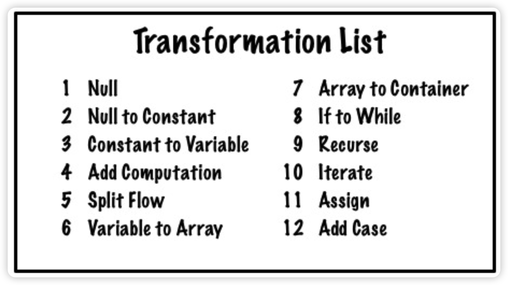

## 1. Null

```
@Test
public void factors() {
	assertThat(primeFactorsOf(1), isListOf());
}
```

이 상태에서 IDE의 hot fix 기능을 이용해서 primeFactorsOf를 구현할 수 있다. 이때 IDE는 null을 반환하도록 구현을 제공한다. 이게 Null Transformation이다.

## 2. Null to Constant

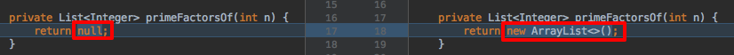

위에서 **null** 대신 **new ArrayList<Integer>()**로 변경하는 것이 Null to Constant Transformation이다.

## 3. Constant to Variable

constant를 variable이나 function의 argument로 변환한다.

ex1). `return new ArrayList<Integer>();`를 변수로 변경하는 것

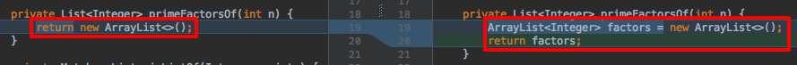

ex2). `factors.add(2)`를 `factors.add(n)`으로 변경하는 것

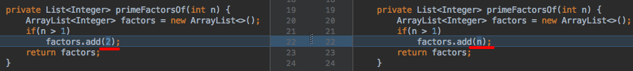

ex3). `n % 2`의 2를 아래와 같이 변수(divisor)로 변환하는 것.

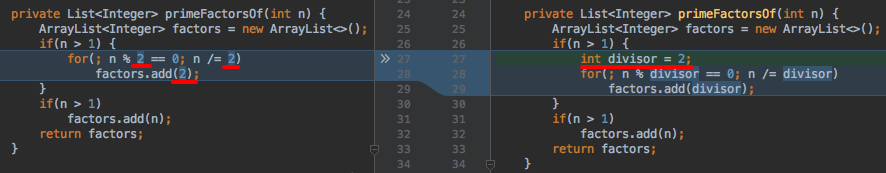

## 4. Add Computation

하나 혹은 둘의 계산식을 추가하는 변환. 심지어 변수를 추가하기도 한다. 하지만 절대 이미 값을 가진 변수에 값을 할당하지는 않는다.

이 변환은 수학 계산 등을 할 수 있고, 다른 함수를 호출할 수도 있다. 하지만 이미 존재하는 변수의 상태를 변경할 수는 없다.

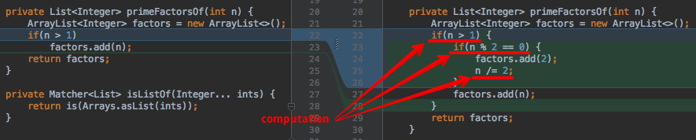

위 예에서 `if(n > 1), if(n % 2 == 0), n /= 2` 가 transformation에 해당한다.

## 5. Split Flow

이 transformation은 대개 if 문장 등과 관계가 있다. 이 transformation은 실행 흐름을 2개(반드시 2개)의 흐름으로 분리한다.

예.

- 2에 대한 테스트를 성공시키기 위해 도입된 `if(n == 2)`

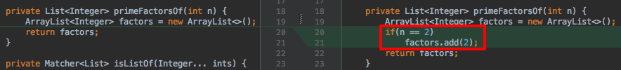

- 4에 대한 테스트를 성공시키기 위해 도입된 `if(n % 2 == 0)`

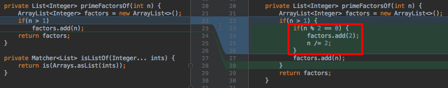

## 6. Variable to Array

아래 stack의 예제에서와 같이 **one-to-many**에 대처하는 기법이다. 

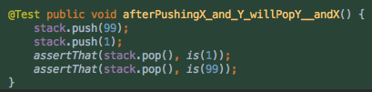

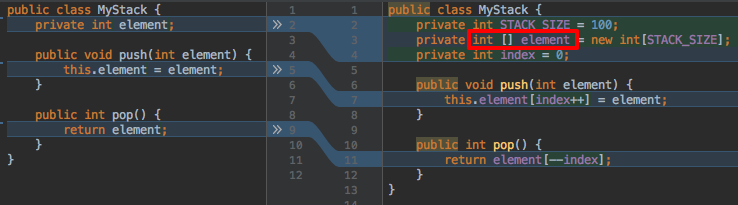

이 transformation은 딱 하나의 값에 대해서 동작하는 코드를 둘 이상의 값에 대해서 동작하도록 만들때 필요한 기법이다.

## 7. Array to Container

ex.
stack에서 `int [] elements = new int[2]`를 `List<Integer> elements = new ArrayList<Integer>()`로 변환하는 것.

## 8. If to While

**분리된 플로우가 반복도 되어야 하는 경우에 적용하는 transformation**

특히 variable to array transformation이 적용되고 나면 variable일때는 잘 동작하던 if가 array인 경우에는 while로 변경되어야 하는 경우가 많다.

예. 8에 대한 테스트를 성공시키기 위해서

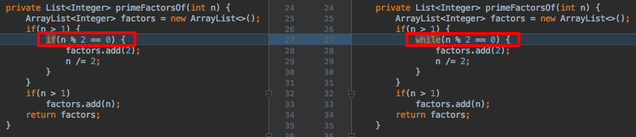

`if (n % 2 == 0) {`를 `while (n % 2 == 0) {`로 변경

예. 9에 대한 테스트를 성공시키기 위해.

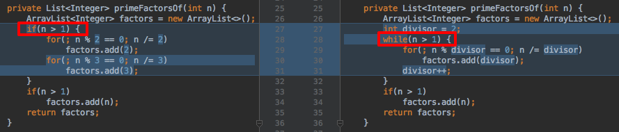

에서 `if(n > 1) {`를 `while(n > 1) {`로 변환하고 `factors.add(divisor);` 다음에 `divisor++;`를 추가

## 9. Recurse

함수에 포함된 계산 로직을 반복해야 하는 경우, 간단히 함수가 자신을 호출하도록 한다.

Recurse transformation은 방치된(neglected)/잊혀진(forgotten) transformation이다. 대부분의 Java, C, C++, C# 프로그래머들은 recursion이 iteration보다 대개의 경우 간단하다는 것을 잊고 있다. 심지어 많은 프로그래머들은 recursion을 생각조차 하지 않고 for loop을 사용하려고 한다.

예. e19 wordWrap

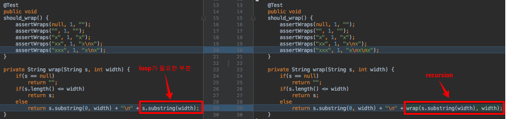

이전 코드에서 마지막 줄에서 loop을 사용하지 않기 때문에 마지막 테스트(xxx)는 실패한다. 새로운 코드와 같이 마지막 라인에 recursion transformation을 적용하면 간단히 해결된다.

## 10. Iterate

이 transformation은 반복되어야 하는 계산 로직이 있는데 어떠한 이유로 recursion은 사용하지 않기를 원할 때 사용한다. 대개의 경우 for loop를 사용한다.

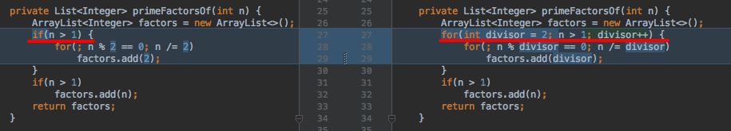

## 11. Assign

이 transformation 이미 존재하는 변수의 값을 변경하고자 할 때 사용한다.

이 transformation은 이미 존재하는 변수의 값을 변경하고자 할때만 사용된다. 변수를 초기화할 때는 assign transformation을 사용하지 않는다.

- `factors.add(2)`
- `n /= 2;`
- `for(....divisor++)`

이렇게 3번 사용되었다.

## 12. Add Case

이미 분리된 흐림(split flow)가 있는데 더 분리하고자 할 때 이 transformation을 사용한다. 기 존재하는 if 문장에 else-if를 추가하거나, switch 문장에 새로운 case 절을 추가하는 것 처럼...

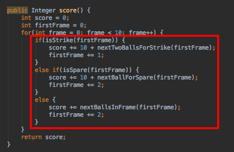

score 함수의 for loop 안의 3가지 if 절.