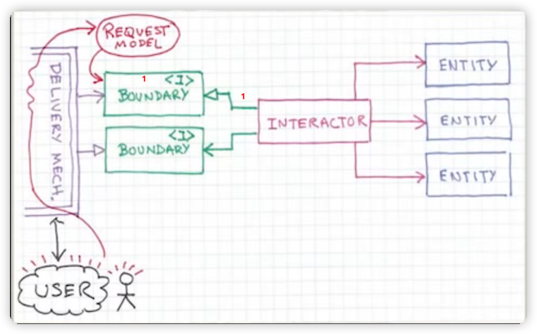
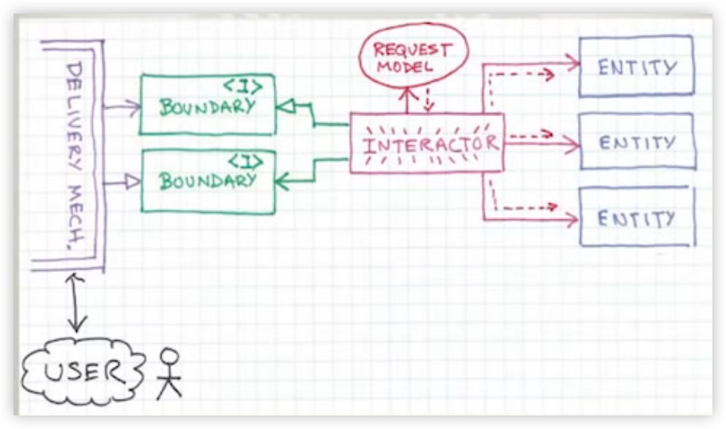
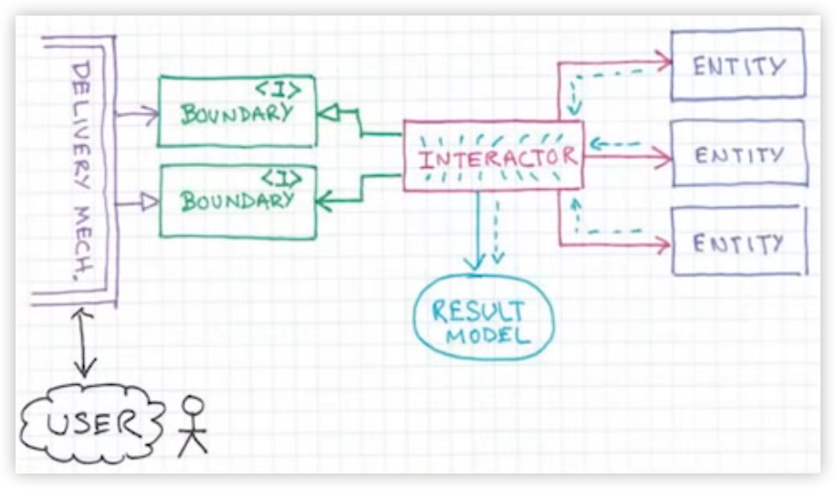
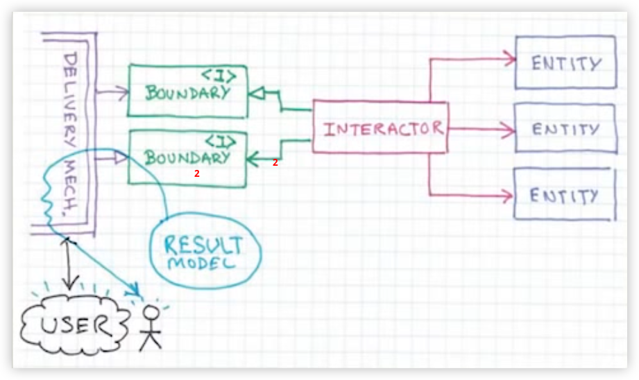
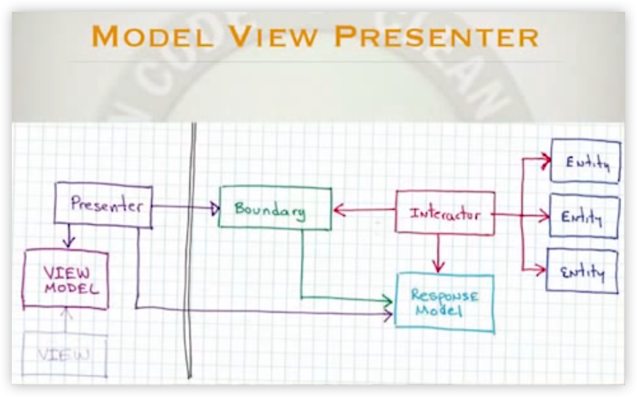
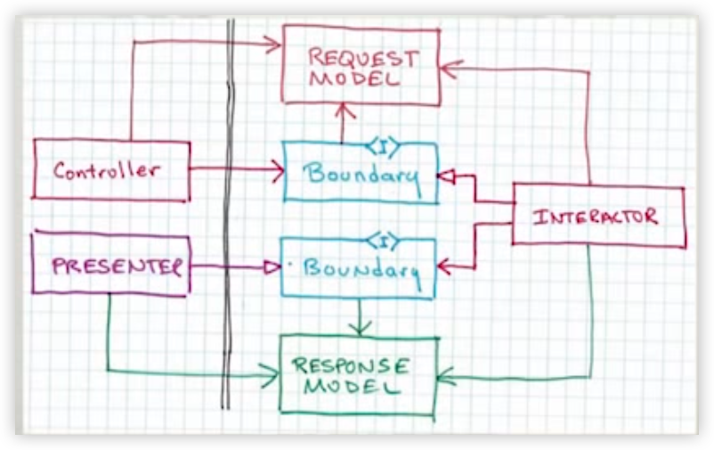
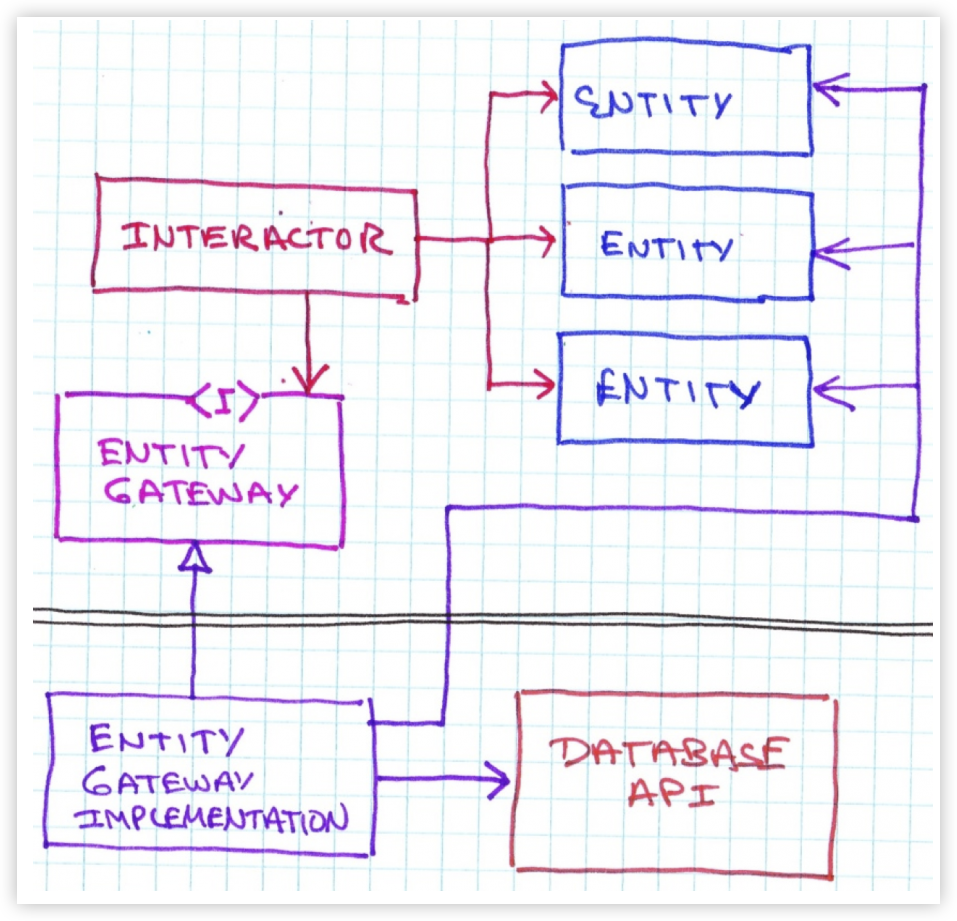

# Architecture

[OOP 2015 Keynote - Robert C. Martin ("Uncle Bob"): Agility and Architecture](https://www.youtube.com/watch?v=0oGpWmS0aYQ)



- Interface(controller, Delivery Mechanism)에서는 사용자의 요청을 RequestModel이라는 DS(Data Structure)에 담고
- Application Layer에 있는 Interactor에 전달함으로써 사용자 요청 처리를 요구한다.
    - 이때 Interactor는 Interface Layer에 노출된 Boundary Interface(1)를 구현하고, Interface Layer는 이 Boundary Interface를 사용한다.

```	
Application Logic vs Domain Logic
- Domain logic: 게시판을 네이버에서 구현하든 카카오에서 구현하든 재사용 가능한 코어 로직
- Application Logic: 게시판을 구현하는 Application(System)마다 달라질 수 있는 로직
```



- Interactor(Usecase Handler, Service Object)는 RequestModel에 있는 값을 이용해서 Repository를 통해 Entity를 얻고, Entity에게 요청 처리를 위임한다.



- Interactor는 처리 결과를 Interface Layer에 전달하기 위해 ResultModel이라는 DS를 생성하고 값을 채운다.
  

- Interactor는 Interface Layer가 제공하는 Boundary Interface(2)를 통해 ResultModel을 반환한다.

이 과정을 좀 더 자세히 살펴보면 아래와 같다.



- Interactor는 ResponseModel을 Boundary 인터페이스를 통해 Interface Layer에 전달하다.
    - Interactor는 Interface Layer의 Presenter가 구현하는 Boundary Interface를 사용한다.
- Presenter는 ResponseModel을 가지고 ViewModel을 생성하고 View에 전달한다.
- View는 ViewModel을 화면에 출력한다.

```
ResponseModel vs ViewModel
responseModel은 도메인에서 사용하는 type, value를 그대로 사용하고, viewModel은 view를 위해 가공한 값을 갖는다.

예. DateTime -> formatted String
```

## 2가지 Boundary Interface의 의미

소스 코드 의존성의 방향을 한 방향(Interface Layer -> Application Layer)으로만 유지한다.

아래 그림과 같이...



물론 Runtime 의존성은 양방향이지만... 이렇게 cyclic dependency가 존재할 때 interface를 통해 제거할 수 있다.

데이터베이스와의 의존성도 아래와 같이 Interface를 통해 관리할 수 있다.



- Interactor가 Database를 사용하기 위해 EntityGateway(Repository Interface)를 사용하지만 실제 구현은 persistence layer에 존재하는
  EntityGatewayImplementation이 제공
- Runtime 의존성은 Application -> Persistence로 흐르지만 소스 코드의 의존성은 Persistence에서 Application Layer로 향함

이게 [DIP(Dependency Inversion Principle)](https://www.youtube.com/watch?v=mI1PsrgogCw)이다.

이를 통해 Interface/Persistence Layer의 구현의 변경이 Applcation/Domain Layer에 영향을 미치지 않게 된다.

Interface/Persistence Layer 구현체가 변경되어도 우리의 소중한 Applcation/Domain Layer는 안전하게 보호되고 재사용될 수 있다.

#### **이게 객체지향의 핵심인 "의존성 관리"이다.**