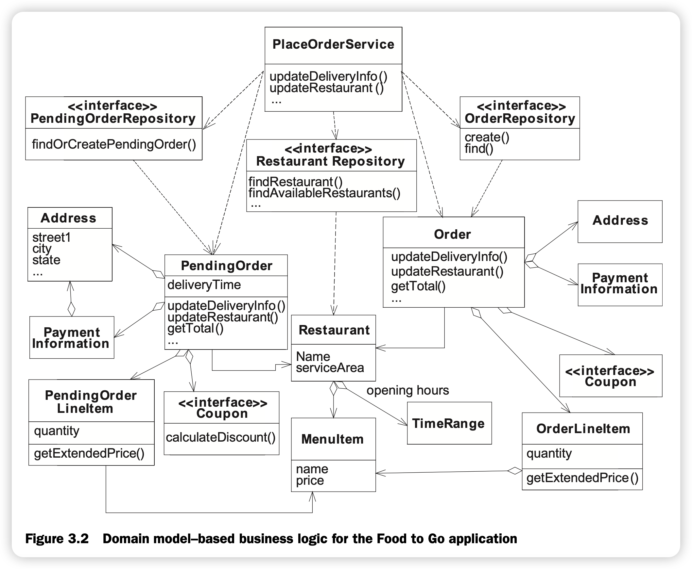

# Domain Model Pattern
- POJOs in Action의 3장

## 예제 도메인 모델

- 도메인 모델은 상호 연결된 객체로 구성됨
- 대부분 객체들은 상태(state)와 행위(behavior)를 가짐

### 핵심 클래스들은 아래와 같음:
- `PlaceOrderService`
  - Place Order 유스케이스의 각 단계(step)에 해당하는 메소드를 정의. 각 메소드들은 도메인 객체의 상태를 갱신함
- `PendingOrder`
  - 이 어플리케이션의 쇼핑 카트임. PendingOrder는 배송 시간 속성, 배소 주소, 주문 항목들, 관련된 식당, 쿠폰 등의 정보를 갖음. 각 주문 항목은 수량과 관련된 메뉴 항목을 갖음.
- `Restaurant`
  - 배달 음식을 준비하는 음식점을 나타냄.
  - 음식점은 이름, 배달 가능한 하나 이상의 메뉴 항목, 일련의 우편번호로 이뤄진 서비스 가능한 지역 정보, 운영 시간 등을 갖음
- `MenuItem`
  - 메뉴 항목을 설명하고, 이름, 설명, 가격 등의 정보를 갖음
- `TimeRange`: 요일별 시작/종류 시간
- `Order`
  - Place Order 유스케이스의 결과로 생성되는 객체
  - PendingOrder와 마찬가지로 배송 주소, 메뉴 항목, 음식점, 쿠폰 등이 포함될 수 있음
  - Order 클래스 하나로 진행 중인 주문과 완료된 주문을 **모두 표현 가능**, 하지만 이 경우 **애플리케이션이 복잡해짐**
  - **2개의 별도 클래스를 사용하면 설계가 단순해짐**
- `Coupon`
  - 주문에 적용할 수 있는 할인
  - 코드로 식별되며 유효 기간이 존재
  - 전략 패턴의 예
    - 쿠폰 종류별로 구현이 하나씩 존재 가능
- `PendingOrderRespository`: 진행 중인 주문을 저장하고 조회하는 데 사용
- `OrderRepository`: 주문을 저장하고 조회하는 데 사용
- `RestaurantRepository`: 음식점을 찾는 기능을 제공

### 도메인 모델의 역할들
- 도메인 클래스들은 자신의 역할(role)에 의해 구분됨
- 클래스가 수행하는 역할을 식별하는 것은 클래스를 명명하기 쉽고 도메인 모델을 설계하는데 도움이 됨
- 클래스의 역할은 일련의 책임과 다른 클래스와의 관계를 의미함
  - 이러한 역할을 이해하는 것은 도메인 모델을 개발하는데 도움이 됨
- DDD에서 역할에 따른 명명 규칙
  - Entities: 고유한 식별자를 갖는 객체
  - Value objects: 고유한 식별자 없이 값으로 구분되는 객체
  - Factories: 엔터티를 생성하는 메소드 제공
    - 복잡한 객체 그래프를 인스턴스화할 필요가 있거나 생성할 객체의 타입을 변경할 필요가 있을 때 팩토리를 사용
    - 생성자에서 시간이 오래 걸리는 일 등이 필요할 경우도
  - Repositories: 엔터티의 집합을 관리하고 영속화 프레임워크를 캡슐화함
    - 팩토리 코드가 단순하다면 팩토리의 역할을 수행하기도
  - Domain Services: 하나의 클래스에 할당할 수 없는 책임을 구현하고 도메인 모델을 캡슐화함
    - 애플리케이션의 워크플로우 구현 
    - 하나의 엔터티에 할당할 수 없고 여러 객체에 걸쳐 있는 책임을 구현
    - 도메인 모델의 클라이언트(Application Service, 프리젠테이션 계층 등)에 의해 호출됨
    - The methods defined by a domain model service are very similar to those defined by a session façade or a POJO façade.
      - The methods usually correspond to the steps of the use case.
      - unlike a façade, doesn’t deal with such things as performing transactions, gathering the data that must be returned to the presentation tier, detaching objects, and all of the other things that the façade has to deal with.
      - Keeping the service sep- arate from the façade is useful because you can work on the service and the rest of the domain model without worrying about “plumbing” and other infrastructure issues.
      - the service is a good place to start when implementing a domain model. 
