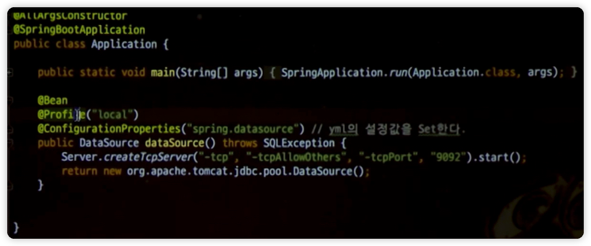
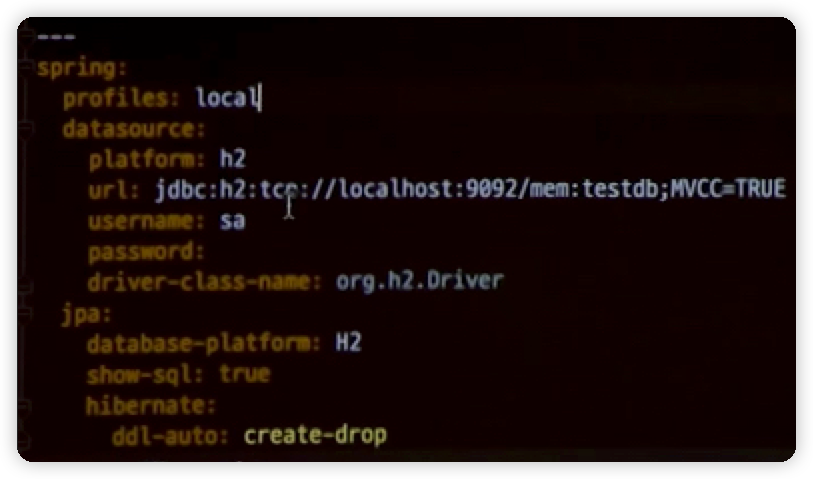

<!-- TOC -->
* [IntelliJ 설치 & 설정](#intellij-설치--설정)
  * [Key Map](#key-map)
  * [Theme](#theme)
  * [Plugins](#plugins)
    * [intellij-reference-diagram](#intellij-reference-diagram)
    * [DesigniteJava](#designitejava)
    * [Digma](#digma)
    * [AceJump](#acejump)
    * [CodeMetrics](#codemetrics)
    * [Dracular Theme](#dracular-theme)
    * [IdeaVim, IdeaVim-EasyMotion](#ideavim-ideavim-easymotion)
    * [Key Promoter X](#key-promoter-x)
    * [Lombok](#lombok)
    * [MyBatisX](#mybatisx)
    * [Live Edit](#live-edit)
  * [주요 에디터 기능](#주요-에디터-기능)
  * [Java8 Migration Feature 활용하기](#java8-migration-feature-활용하기)
  * [overriden hot key](#overriden-hot-key)
  * [H2 File DB 사용하기](#h2-file-db-사용하기)
  * [IntelliJ를 JIRA와 연동해서 사용하기](#intellij를-jira와-연동해서-사용하기)
  * [git flow integration](#git-flow-integration)
  * [IntelliJ에서 Json 작업 쉽게 하기](#intellij에서-json-작업-쉽게-하기)
    * [json view plugin](#json-view-plugin)
    * [DTO generator plugin](#dto-generator-plugin)
    * [POJO to JSON plugin](#pojo-to-json-plugin)
    * [문자열에서 바로 Json String 생성하기](#문자열에서-바로-json-string-생성하기)
  * [한영변환 플러그인](#한영변환-플러그인)
  * [참고자료](#참고자료)
<!-- TOC -->

# IntelliJ 설치 & 설정

IntelliJ Ultimate Edition를 사용 중인데 아래 설명하는 부분을 추가적으로 설치, 설정하여 사용중이다.

## Key Map

"mac osx 10.5+"를 사용

## Plugins
### [intellij-reference-diagram](https://github.com/Stefku/intellij-reference-diagram)
### [DesigniteJava](https://plugins.jetbrains.com/plugin/13380-designitejava)
### [Digma](https://plugins.jetbrains.com/plugin/19470-digma-continuous-feedback)
### AceJump
- "ctrl+;"를 눌러서 활성화 한 후 이동하고 하는 코드에 포함된 글자를 타이핑
- 그럼 이동 가능한 위치에 글자가 표시됨
- 해당 글자를 타이핑하면 그곳으로 바로 이동

### CodeMetrics

### Dracular Theme

### IdeaVim, IdeaVim-EasyMotion
- intellij에서 vim keymapping을 이용하기 위한 플러그인

### Key Promoter X
- https://plugins.jetbrains.com/plugin/9792-key-promoter-x/
- IDEㅔ서 마우스를 사용하면 단축키를 보여줌

### Lombok
- intellij 내에서 lombok을 사용하기 위한 플러그인

### MyBatisX

### [Live Edit](http://blog.jetbrains.com/webide/2012/08/liveedit-plugin-features-in-detail/)
- Live Edit plugin을 설치하고, settings에서 live edit를 enable하면 브라우저에서 현재 html을 바로 볼 수 있음.
- 브라우저가 일단 열린 후엔 ctrl+r로 갱신(빌드가 되어야 반영됨)

## 주요 에디터 기능

- Next Highlighted Usage: ctrl+opt+down arrow
- Incremental selection: Cmd(Ctrl) + W, opt+up arrow
- Reformat code: Option + Cmd + L
- Find members in current file: Cmd + F12
- Show recently changed files: Cmd + Shift + E
    
## overriden hot key

- select in project view: Ctrl + Opt + L

## H2 File DB 사용하기

## [IntelliJ를 JIRA와 연동해서 사용하기](http://jojoldu.tistory.com/260)

## [git flow integration](http://jojoldu.tistory.com/268)

## [IntelliJ에서 Json 작업 쉽게 하기](http://jojoldu.tistory.com/273)

### json view plugin

### DTO generator plugin

- DTO from json

### POJO to JSON plugin

- make json(class명에서 우클릭)

## 참고자료

- [인텔리j 활용 꿀팁 42가지 정리](http://www.popit.kr/인텔리j-활용-꿀팁-42가지-정리/)
- [Collaboration within IntelliJ IDEA](https://www.youtube.com/watch?v=wBXSUdT1jX0)
- [aafwu00님의 IntelliJ Tip 모음](https://gist.github.com/aafwu00/e48a5b16318ca2c5b3c0f8e32f9da886)
