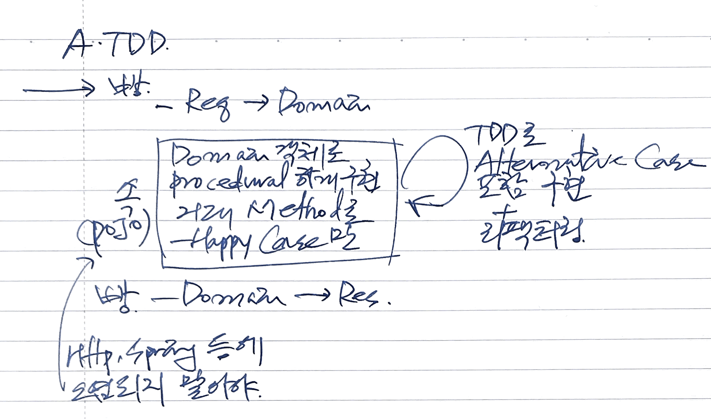

## Vertical Slicing(Implement and Refactor)

1. Acceptance Test 추가
   - happy case에 대해서
2. Acceptance Test가 Vertical Slicing 방식으로 동작하도록 빠르게 구현
   - 처음엔 happy case가 동작하도록 procedural(imperative)하게 구현
3. Refactor
    - 빵-속-빵으로 메소드 분리
      - 빵
        - request -> domain model
        - domain model -> response
      - 속
        - http, spring 등과 관련된 코드가 없는 POJO가 되도록
        - 거대 메소드가 될 수도 있음
   - 속을 리팩터링을 통해 빼내야. 안 빼내면 속에 해당하는 메소드들이 빵과 한 클래스에 증가하게 됨. 그러다 보면 빵과 속이 분리가 달 안됨
     - aggregate root / domain service / new value object 등으로 속을 이동
     - single entry point가 되도록

## TDD with Sociable Unit Test
- Inside-out 방식
- bottom-up 방식. 나중에 빵과 붙일 때 이슈가 있을 수 있음
- outside-in도 sociable로
- 외부에서 진입점을 최소화해야 변경으로 영향을 줄일 수 있음