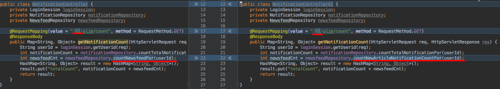
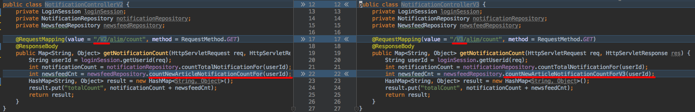
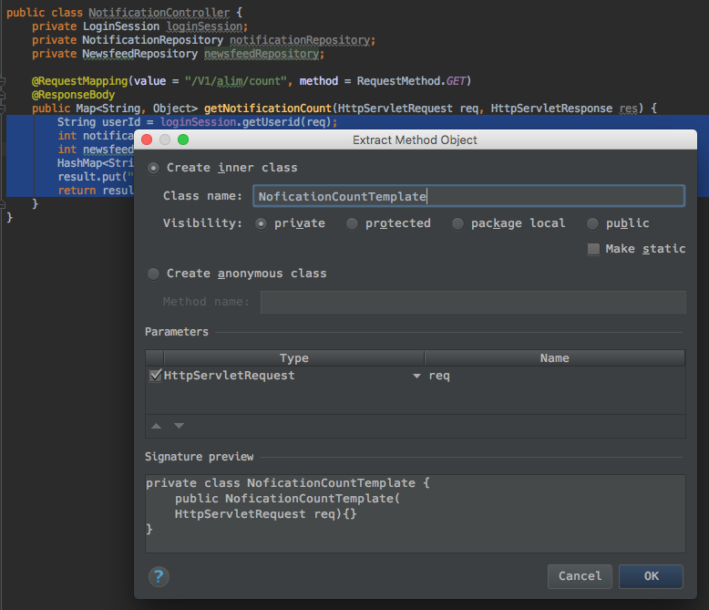
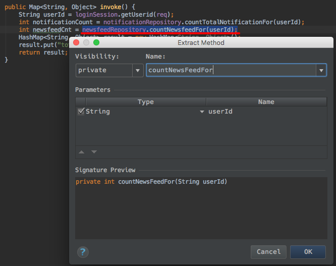
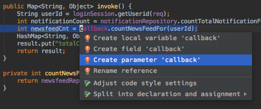

# api controller의 버전별 중복





설명을 위해 많이 단순화했다. 3개의 버전별 클래스에서 newsfeedCnt를 구하는 로직만 다르다.

이런 중복을 해결하는 방법은 Template Method Pattern와 Strategy Pattern이 잇다. Template Method Pattern이 더 쉽기는 하나 상속을 이용해서 기능을 재사용한다는 점이 후에 문제를 일으킬 수 있는 함정이 있다. 상속은 타입을 표현하기 위해 사용하는 것이 바람직하다. 
또 `@RequestMapping(value = "/V3/alim/count", method = RequestMethod.GET)` 부분이 3개의 클래스에 모두 다르게 정의되어 있어서 Template Method Pattern을 적용하기 어려운 점도 있다.

여기서는 Spring 소스에서 많이 보이는 Strategy Pattern을 적용해서 Template-Callback 방식을 구현해 보도록 하겠다.

## Template Class 구현




`int newsfeedCnt = countNewsFeedFor(userId);`

이 라인을 

`int newsfeedCnt = callback.countNewsFeedFor(userId);`

로 변경하고 IntelliJ의 quick fix를 이용해서 `NotificationCountCallback callback`을 파라미터로 추가



인터페이스 생성

```
public interface NoficationCountCallback {
    int countNewsFeedFor(String userId);
}
```

```
	@RequestMapping(value = "/V1/alim/count", method = RequestMethod.GET)
    @ResponseBody
    public Map<String, Object> getNotificationCount(HttpServletRequest req, HttpServletResponse res) {
        return new NoficationCountTemplate(req).invoke(callback);
	}
```
를 컴파일이 되도록 아래와 같이 수정

```
    @RequestMapping(value = "/V1/alim/count", method = RequestMethod.GET)
    @ResponseBody
    public Map<String, Object> getNotificationCount(HttpServletRequest req, HttpServletResponse res) {
        return new NoficationCountTemplate(req).invoke(new NoficationCountCallback() {
            @Override
            public int countNewsFeedFor(String userId) {
                return newsfeedRepository.countNewsfeedFor(userId);
            }
        });
	}
```

NoficationCountTemplate를 move 기능을 이용해서 외부 클래스로 추출

```
class NoficationCountTemplate {
    private NotificationController notificationController;
    private HttpServletRequest req;

    public NoficationCountTemplate(NotificationController notificationController, HttpServletRequest req) {
        this.notificationController = notificationController;
        this.req = req;
    }

    public Map<String, Object> invoke(NoficationCountCallback callback) {
        String userId = notificationController.loginSession.getUserid(req);
        int notificationCount = notificationController.notificationRepository.countTotalNotificationFor(userId);
        int newsfeedCnt = callback.countNewsFeedFor(userId);
        HashMap<String, Object> result = new HashMap<String, Object>();
        result.put("totalCount", notificationCount + newsfeedCnt);
        return result;
    }
}
```

컴파일 오류 해소

```
String userId = notificationController.loginSession.getUserid(req);
int notificationCount = notificationController.notificationRepository.countTotalNotificationFor(userId);
```

를 아래와 같이 수정

```
String userId = loginSession.getUserid(req);
int notificationCount = notificationRepository.countTotalNotificationFor(userId);
```

loginSession과 notificationRepository를 field variable로 추가, constructor에서 parameter로 받도록 변경, notificationController는 삭제(change signature로)

```
class NoficationCountTemplate {
    private HttpServletRequest req;
    private LoginSession loginSession;
    private NotificationRepository notificationRepository;

    public NoficationCountTemplate(HttpServletRequest req, LoginSession loginSession, NotificationRepository notificationRepository) {
        this.req = req;
        this.loginSession = loginSession;
        this.notificationRepository = notificationRepository;
    }

    public Map<String, Object> invoke(NoficationCountCallback callback) {
        String userId = loginSession.getUserid(req);
        int notificationCount = notificationRepository.countTotalNotificationFor(userId);
        int newsfeedCnt = callback.countNewsFeedFor(userId);
        HashMap<String, Object> result = new HashMap<String, Object>();
        result.put("totalCount", notificationCount + newsfeedCnt);
        return result;
    }
}
```

```
public class NotificationController {
    private LoginSession loginSession;
    private NotificationRepository notificationRepository;
    private NewsfeedRepository newsfeedRepository;

    @RequestMapping(value = "/V1/alim/count", method = RequestMethod.GET)
    @ResponseBody
    public Map<String, Object> getNotificationCount(HttpServletRequest req, HttpServletResponse res) {
        return new NoficationCountTemplate(req, loginSession, notificationRepository).invoke(new NoficationCountCallback() {
            @Override
            public int countNewsFeedFor(String userId) {
                return newsfeedRepository.countNewsfeedFor(userId);
            }
        });
	}
}
```

나머지 Controller들에도 NoficationCountTemplate을 적용
